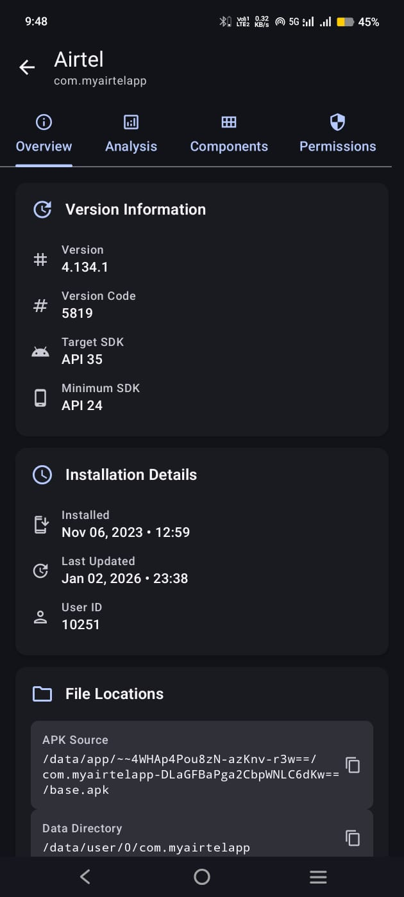

# AppsAnalyzer 📱

AppsAnalyzer is a powerful Android application built with **Jetpack Compose** that scans your device's installed applications and analyzes their underlying technology. It helps developers and enthusiasts identify which apps are built using **Flutter**, **React Native**, **Expo**, **Kotlin Multiplatform (KMM)**, or standard **Native** Android development.

<p align="center">
  
  
</p>

## ✨ Key Features

- **🔍 Smart Analysis**: Automatically detects framework signatures inside APKs:
  - **Flutter**: Identifies `libflutter.so`, `flutter_assets`, etc.
  - **React Native**: Detects `libreactnativejni.so`, `index.android.bundle`, etc.
  - **Expo**: Recognizes Expo modules and libraries.
  - **KMM**: Checks for Kotlin Multiplatform shared logic.
  - **Native**: Identifies apps using standard Android SDKs.
- **📊 Statistics Dashboard**: Visual breakdown of installed apps by technology.
- **🔎 Advanced Search & Filtering**: Quickly find apps by name or filter by specific frameworks (e.g., show only Flutter apps).
- **⚡ Modern UI/UX**: Built entirely with Jetpack Compose using Material 3 design principles.
- **💾 Offline Caching**: Uses Room database to cache analysis results for instant loading.
- **🚀 Performance**: Efficient background analysis using Kotlin Coroutines and Flow.

## 🛠 Tech Stack

- **Language**: [Kotlin](https://kotlinlang.org/)
- **UI Framework**: [Jetpack Compose](https://developer.android.com/jetpack/compose) (Material 3)
- **Architecture**: MVVM + Clean Architecture
- **Dependency Injection**: [Hilt](https://dagger.dev/hilt/)
- **Local Database**: [Room](https://developer.android.com/training/data-storage/room)
- **Concurrency**: Coroutines & Flow
- **Analysis Logic**: Custom `ZipFile` analysis to inspect APK contents and `AndroidManifest.xml`.

## 📱 How It Works

AppsAnalyzer inspects the internal structure of installed APKs without requiring root access. It looks for specific markers:

- **Flutter**: Presence of Flutter engine libraries and asset structures.
- **React Native**: JavaScript bundles and Hermes/JSC binaries.
- **Expo**: Expo-specific native modules.
- The app uses a scoring system to accurately categorize apps, minimizing false positives.

## 📥 Download & Installation

You can download the latest APK directly here:
[**📥 Download AppsAnalyzer v1.0.0 APK**](public/apps-analyzer-1.0.0.apk)

### Building from Source

1. Clone the repository:
   ```bash
   git clone https://github.com/yourusername/AppsAnalyzer.git
   ```
2. Open the project in **Android Studio**.
3. Sync Gradle files.
4. Run the app on your device or emulator.

## 🤝 Contributing

Contributions are welcome! If you find an app that is miscategorized, please open an issue with the package name and the actual technology used.

1. Fork the Project
2. Create your Feature Branch (`git checkout -b feature/AmazingFeature`)
3. Commit your Changes (`git commit -m 'Add some AmazingFeature'`)
4. Push to the Branch (`git push origin feature/AmazingFeature`)
5. Open a Pull Request

## 📄 License

Distributed under the MIT License. See `LICENSE` for more information.

---

Built with ❤️ using Kotlin and Jetpack Compose.

Distributed under the MIT License. See `LICENSE` for more information.

---

Built with ❤️ using Kotlin and Jetpack Compose.
